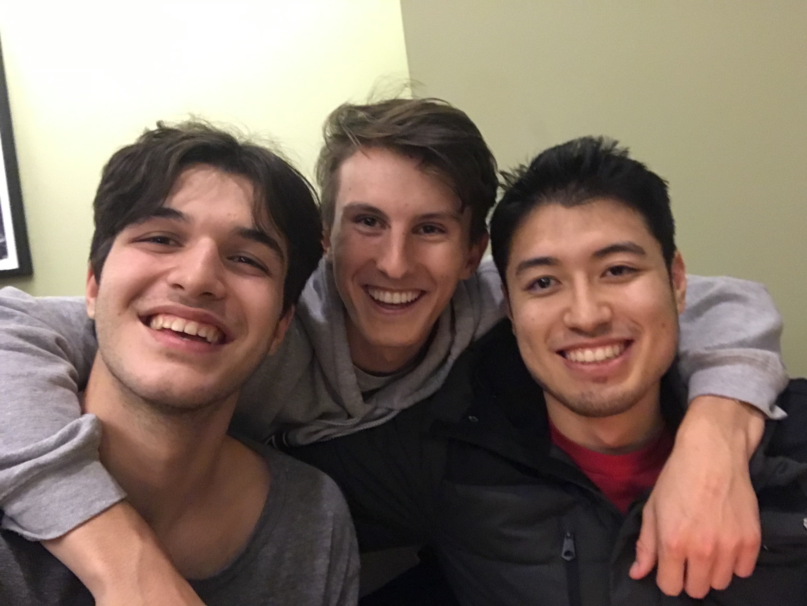

### Norn Mailing List System

The Norn Mailing List System is a way of keeping track of mailing lists with easy to use
functionality and rules.

For an explicit description of the rules, we encourage you to read the system's specification
as detailed on the Fall 2019 6.031 project website at http://web.mit.edu/6.031/www/fa19/projects/norn/

To understand what we have created, we have created a recursive abstract data type that is derived
from a thorough grammar file that creates an iterable abstract syntax tree.

The ADT is called Expression, and is implemented by various classes found below:
- Email
- Mailing List
- Intersection
- Difference
- Union
- ListDefinition
- Parallel
- Sequence
- EmptyEmailSet

These various implementations have differing rules in regard to their input data and operations,
which can again be found in the project handout.

We have many ways of using the system. The main way is to use Main.java, where you can input
expressions that will be interpreted and executed. You can also use our WebServer, where
various users can connect and build their mailing lists.

We also offer functionality for loading and saving mailing lists to keep track of your data.

Let us now tell you about the team:

Here we are at 3am the night before the project was due putting in those final touches
to make our system as beautiful as it can be.

This is Giannis Chatziveroglou. Giannis is a sophomore here at MIT playing basketball and participating
in his professional engineering fraternity, Theta Tau. He is from Athens, Greece and loves gyros
and having dark hair.

Giannis contributed by coding the parser tests, the ADT/evaluation implementation, and the visualization
specs.

This is Brett Allen. Brett is a sophomore here at MIT playing on the varsity volleyball team
and participating in his professional engineering fraternity, Theta Tau. He is from San Jose,
California and loves long walks on the beach.

Brett contributed by providing the grammar and parser implementations, as well as the evaluation specs
and the visualization tests.

This is Baptiste Bouvier. Baptiste is a sophomore here at MIT participating in crew and avidly 
contributes to his fraternity, Phi Sigma Kappa. He is from London, United Kingdom and loves
British accents and podcasts about soup.

Baptiste contributed by coding the parser specs, thorough evaluation tests, and the visualization/
web server implementation.
